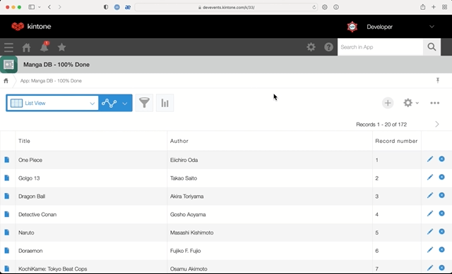

# Build a Search Bar in React for [Kintone Web Database](https://developer.kintone.io/hc/en-us/)

Thank you for attending our **Kintone x React** workshop!  
Check out [meetup.com/Kintone-Developers](https://www.meetup.com/Kintone-Developers/) to check out all of our upcoming events!

## Outline <!-- omit in toc --> <!-- markdownlint-disable MD007 -->

* [Demo of Build](#demo-of-build)
* [Get Started](#get-started)
  * [⚡ Notes ⚡](#-notes-)
* [Overview of the Repo](#overview-of-the-repo)
* [Kintone Web Database & Credentials](#kintone-web-database--credentials)
  * [🚀 Getting your FREE Kintone Database](#-getting-your-free-kintone-database)
* [Create a Kintone Web Database App](#create-a-kintone-web-database-app)
* [Create a `.env` file](#create-a-env-file)
* [Input the App ID](#input-the-app-id)
* [Build the customization](#build-the-customization)
* [Debugging - Let's Fix Those Problems 💪](#debugging---lets-fix-those-problems-)
  * [Errors related to .env](#errors-related-to-env)
  * [`npm install` command is not working](#npm-install-command-is-not-working)
  * [@kintone/customize-uploader not working?](#kintonecustomize-uploader-not-working)
  * [Errors related to Kintone Subdomain](#errors-related-to-kintone-subdomain)
    * [How do I get my Kintone Subdomain?](#how-do-i-get-my-kintone-subdomain)
    * [How do I log into my Kintone account?](#how-do-i-log-into-my-kintone-account)
* [Appendix](#appendix)
  * [Files](#files)
  * [Branches](#branches)

<!-- markdownlint-enable MD007 -->

## Demo of Build



## Get Started

First, let's download the [ahandsel/Kintone_React_Search_Bar](https://github.com/ahandsel/Kintone_React_Search_Bar) Repo and go inside the folder.

Once you are inside the folder, let's install the dependencies!

```shell
cd Downloads

git clone -b workshop https://github.com/ahandsel/Kintone_React_Search_Bar

cd Kintone_React_Search_Bar

npm install

npm install -g @kintone/customize-uploader
```

### ⚡ Notes ⚡

⚡ React requires **Node ≥ 10.16** & **npm ≥ 5.6** ⚡

  * Check the versions inside the `React_Workshop_by_Kintone` folder:
    * `node -v`
    * `npm -v`
  * Not the correct versions or Confused? 🤔 → Check out the [Guide on Installing Node.js & npm](docs/Install_NodeJS_npm.md) Doc

⚡ Note: Please ignore the package deprecation warnings ⚡

🔎 The `npm install` command installs the required dependencies defined in the package.json files and generates a node_modules folder with the installed modules.

---

## Overview of the Repo

| File                                                         | Purpose                                                                      | Modify?         |
| ------------------------------------------------------------ | ---------------------------------------------------------------------------- | --------------- |
| [package.json](package.json)                                 | Project's metadata & scripts for building and uploading the customization    |                 |
| [webpack.config.js](webpack.config.js)                       | Holds the Webpack's configuration for the react project                      |                 |
|                                                              |                                                                              |                 |
| [.env.example](.env.example)                                 | The template for the .env file                                               |                 |
| [.env](.env)                                                 | Holds the Kintone login credential and View ID                               | Create it!      |
|                                                              |                                                                              |                 |
| [scripts/npm-start.js](scripts/npm-start.js)                 | Script that uses `npm-run-all` to run `build` & `upload` scripts in parallel |                 |
| [customize-manifest.json](customize-manifest.json)           | Kintone Customize Uploader's configuration file                              | Add your App ID |
| [dist/KintoneCustomization.js](dist/KintoneCustomization.js) | The bundled JS build that will be uploaded to Kintone                        |                 |
|                                                              |
| [src/index.js](src/index.js)                                 | Heart of the React Project handling `<App />` and Kintone Events             |                 |
| [src/index.html](src/index.html)                             | HTML that reflects the Kintone Custom View <br> Only `<div id="root"></div>` |                 |
| [src/index.css](src/index.css)                               | Styling for the React Project                                                |                 |
| [src/getRecords.js](src/requests/getRecords.js)              | Fetches Kintone records, transforms response, & returns array of objects     |                 |
|                                                              |                                                                              |                 |
| [src/components/ResultList.js](src/components/ResultList.js) | Creates a list from the list items array                                     |                 |
| [src/components/SearchBar.js](src/components/SearchBar.js)   | Creates the search bar input                                                 |                 |

---

## Kintone Web Database & Credentials

_Built for teamwork, designed by you_ <!-- markdownlint-disable MD036 --> <!-- markdownlint-enable MD036 -->

### 🚀 Getting your FREE Kintone Database

#### ① Sign-Up for Developer Program Account (Website) 🌐 <!-- omit in toc -->

  * [bit.ly/KDP_signup](https://bit.ly/KDP_signup)
    * ⚠ Do NOT use Safari
    * ⚡ Accept Cookies First
    * ✅ Use Chrome & Firefox

#### ② THEN Create a Kintone Subdomain (Database) 📂 <!-- omit in toc -->

  * [bit.ly/K_DevLic](http://bit.ly/K_DevLic)
    * ⚡ Only use lowercase, numbers, & hyphens in your subdomain
    * ⚠ Do not use uppercase or special characters

#### 📺 Sign up for Kintone Developer Program & Developer License | Video <!-- omit in toc -->

<p align="center">
  <a href="https://youtu.be/Gzz8SbTuoFg">
    
  </a>
</p>

---

## Create a Kintone Web Database App

Let's create a Kintone App to list off your favorite [manga](https://en.wikipedia.org/wiki/Manga)s!

Here are the required fields & their configurations for our workshop:

| Field Type | Field Name | Field Code | Note               |
| ---------- | ---------- | ---------- | ------------------ |
| Text       | Title      | `title`    | The manga's title  |
| Text       | Author     | `author`   | The manga's author |

Then create a Custom View
  * From App Settings, click on the **Views** tab
  * Click on the Plus Button ⊕ to create a View
  * Select `Custom view` under **Visible Fields and Column Order** section
  * Get the `View ID`! (Required in `.env` file)
  * Under **HTML Code**, input `<div id="root"></div>`
  * Save!

Be sure to click **Save** and **Activate App** buttons! 💪

Confused? 🤔 → Check out the [How to Create a Kintone Database App](https://youtu.be/pRtfn-8cf_I) video 📺

<!--  -->

---

## Create a `.env` file

Using the [.env.example](.env.example) file as a temple, create a `.env` file that will contain your login credentials and the Kintone App's View ID.

This is what the [.env.example](.env.example) looks like:

```txt
KINTONE_BASE_URL=
KINTONE_USERNAME=
KINTONE_PASSWORD=
VIEW_ID=
```

Here is what your `.env` might look like:

```txt
KINTONE_BASE_URL="https://example.kintone.com"
KINTONE_USERNAME="example@gmail.com"
KINTONE_PASSWORD="ILoveKintone!"
VIEW_ID="1234567"
```

⚠️ DO NOT EDIT NOR DELETE THE [.env.example](.env.example) FILE!  
[.env.example](.env.example) is used by env-cmd to verify that `.env` file is correctly configured.

---

## Input the App ID

The Kintone Customize Uploader uses [customize-manifest.json](customize-manifest.json) to determine where to upload the JavaScript file (_which Kintone App_).

```json
{
    "app": "10",
    "scope": "ALL",
    ...
```

So to ensure the file gets uploaded to the correct App, replace the `10` with your App ID.

**What is my App ID?** 🤔  
  * Go to your Kintone App & grab the URL
  * Kintone App's URL follows this template: `https://<SUBDOMAIN>.kintone.com/k/<App ID>/show#record=<RECORD ID>`
  * Grab the number between the `/k/`
  * Example: `https://example.kintone.com/k/1/` -> The App's ID is `1`

---

## Build the customization

1. Build the customization in the following files inside `./src/`
   * `index.html`, `index.js`, `index.css`, etc.
2. Run `npm run dev` to generate testing builds continuously
3. Run `npm run production` to create a production version
   * To directly upload the Kintone customization, use `./dist/KintoneCustomization.js`.
   * For more details, refer to [Customizing an App with JavaScript and CSS](https://get.kintone.help/k/en/user/app_settings/js_customize.html)
4. Run `npm run start`
   * This will trigger webpack & kintone-customize-uploader to run while watching `./src/index.js` for changes
   * Input Kintone credentials when asked
5. Refresh the Kintone App to see the changes!

Good luck coding! ᕙ(⇀‸↼‶)ᕗ

---

## Debugging - Let's Fix Those Problems 💪

Here is a rundown of common problems & their solutions!

### Errors related to .env

Are you getting one of the following error messages?
If you get one of the following error messages, then please verify , and you have not modified the `.env.example`

  * `Failed to find .env file at default paths: [./.env,./.env.js,./.env.json]`
  * `[webpack-cli] Error: Missing environment variable: KINTONE_BASE_URL`
  * `[webpack-cli] Error: Missing environment variable: KINTONE_USERNAME`
  * `[webpack-cli] Error: Missing environment variable: KINTONE_PASSWORD`
  * `[webpack-cli] Error: Missing environment variable: VIEW_ID`

**Then** please do the following:
  1. Verify your `.env` file has been correctly configured! [Details](#create-a-env-file)
  2. Make sure you did NOT change the `.env.example` file!
     * It should still be in your project folder
     * It should NOT contain your login information

### `npm install` command is not working

1. Verify the Node.js & npm versions **inside** the `Kintone_React_Search_Bar` folder
2. Just installed Node.js? Verify you configured Node.js versions **inside** the `Kintone_React_Search_Bar` folder

  * Mac: `nodenv local 14.5.0`
  * Windows: `nvm use 14.5.0`

### @kintone/customize-uploader not working?

Verify that you are inputting the exact base URL for Kintone credentials questions

  * Correct: `https://example.kintone.com` ✅
  * Incorrect: `https://example.kintone.com/` or `example.kintone.com` ❌

### Errors related to Kintone Subdomain

#### How do I get my Kintone Subdomain?

This may be a bit confusing since the **order** matters.  
You need to sign-up for [Developer Program Account (Website) 🌐](https://bit.ly/KDP_signup) **BEFORE** creating your [Kintone Subdomain (Database) 📂](http://bit.ly/K_DevLic).

Check out our [Sign up for Kintone Developer Program & Developer License](https://youtu.be/Gzz8SbTuoFg) YouTube video:
  * [](https://youtu.be/Gzz8SbTuoFg)

#### How do I log into my Kintone account?

You need three things to log into your Kintone account:
1. Subdomain - Unique alphanumerica & underscore text that you filled out when creating your [Kintone Subdomain (Database) 📂](http://bit.ly/K_DevLic).
2. Username (Login Name) - By default, it is your email address
3. Password - The password you set after activiating your Kintone Developer License

Your Kintone **Subdomain** determines the URL used to access your Kintone account
  * Kintone's URL follows this template: `https://<SUBDOMAIN>.kintone.com/`
  * Example: The `devevents` subdomain leads to `https://devevents.kintone.com/`

##### Having Trouble Logging In?
  * ⚠️ Make sure your password is correct (surprisingly a common problem)
  * You can always reset the the password by clicking on the **Having Trouble Logging In?** link on the login page
    * Input your email & reset the password

---

## Appendix

### Files

| Files                                               | Purpose                                                                       |
| --------------------------------------------------- | ----------------------------------------------------------------------------- |
| [Install_NodeJS_npm.md](docs/Install_NodeJS_npm.md) | Guide on Installing Node.js & npm                                             |
| [Workshop.md](docs/Workshop.md)                     | Workshop Overview & Notes                                                     |
| [References.md](docs/References.md)                 | List of all the articles referred to when building this project               |
| [Manga_Data.csv](docs/Manga_Data.csv)               | Manga title and author data that can be uploaded to your Kintone Manga DB App |
| [CustomizeUploader.md](docs/CustomizeUploader.md)   | Guide on configuring the @kintone/customize-uploader                          |

### Branches

| Branches     | Purpose                             | Status                                                                                                |
| ------------ | ----------------------------------- | ----------------------------------------------------------------------------------------------------- |
| `main`       | Starting point for the workshop     | `src/index.js`, `src/components/SearchBar.js`, & `src/components/ResultList.js` needs to be completed |
| `workshop`   | _same as the main branch_           | _same as the main branch_                                                                             |
| `dev`        | Development branch for the KDP team | Pending Improvements                                                                                  |
| `production` | Stores code ready to be used        | Latest version of the working build                                                                   |
